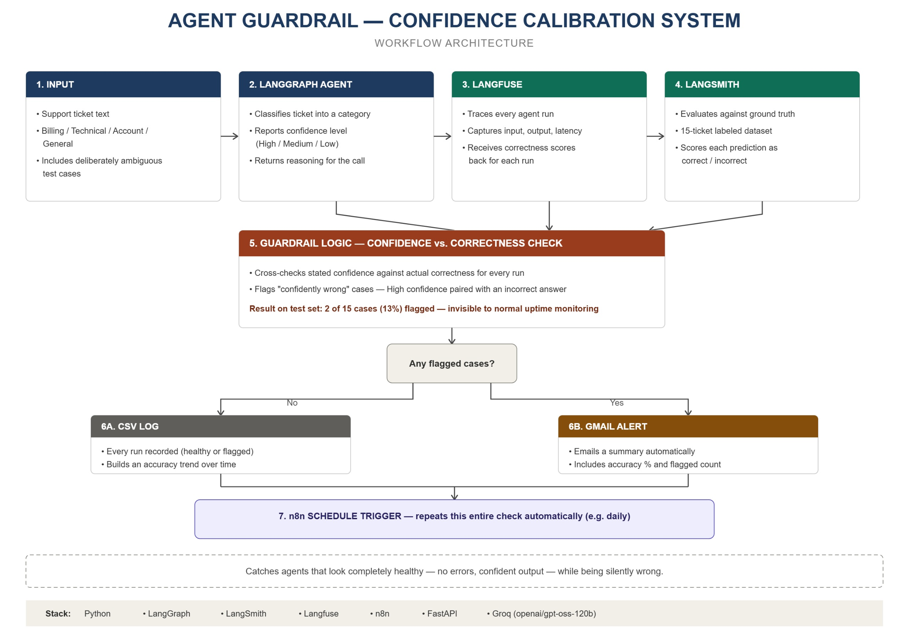

# LLM Agent Guardrail: Confidence Calibration & Alerting

A monitoring system that catches a failure mode standard AI observability misses: an LLM agent that looks completely healthy — no errors, confident-sounding output — while silently being wrong.

## Problem

AI agents in production can run perfectly (no crashes, normal latency, confident output) while still delivering incorrect results. Standard monitoring only checks whether an agent *ran* — not whether it was actually *right*. This is a real, industry-wide gap: Gartner projects that over 40% of agentic AI projects will be cancelled by 2027, largely because teams can't tell if their agents are delivering real value or just running without errors. A model's stated confidence often has no real relationship to its actual correctness — a phenomenon known in ML as poor **confidence calibration**.

## Solution

This project builds a support-ticket classification agent, then wraps it in a guardrail layer that measures the agent's confidence calibration — whether its stated confidence actually predicts correctness — and automates catching the cases where it doesn't.

**Pipeline:**
```
LangGraph agent → Langfuse (tracing + scoring) → LangSmith (ground-truth evaluation) 
→ Guardrail logic (calibration check) → n8n (scheduling, alerting, logging)
```

## How It Works

1. **LangGraph** agent classifies incoming support tickets into a category (Billing, Technical, Account, General) and reports its confidence level and reasoning
2. **Langfuse** traces every run — full input/output, latency, and execution data — and receives correctness scores back for each run
3. **LangSmith** evaluates the agent against a hand-labeled ground-truth dataset (15 tickets, including deliberately ambiguous ones) to determine actual correctness
4. **Guardrail logic** cross-checks stated confidence against actual correctness, flagging any case where the agent was confident but wrong (poor calibration)
5. **n8n** runs this check on a schedule, calls the guardrail API, branches on the result, sends an email alert when confidently-wrong cases are found, and every run (healthy or flagged) is logged to a CSV for historical tracking

## Results

On a 15-ticket test set including intentionally ambiguous cases, the agent scored **80% overall accuracy** — but the guardrail specifically caught **2 cases (13%) where the agent was "High confidence" while being factually wrong**. Both failures followed the same pattern: the agent anchored on payment-related keywords ("paid," "card") instead of the actual root cause, misclassifying technical access/billing-gateway issues as pure Billing tickets.

This is exactly the kind of failure a standard uptime/error dashboard would never catch — the agent never errored, never timed out, and sounded confident throughout.

## Why This Matters

Most AI agent projects add another task-specific agent to a pipeline. This project instead builds the **verification layer** the industry has identified as missing — the reason, according to Gartner, that a large share of agentic AI projects get cancelled isn't broken technology, it's the inability to prove agents are actually delivering correct outcomes.

## Tech Stack

- **LangGraph** — agent orchestration
- **LangSmith** — ground-truth evaluation and dataset management
- **Langfuse** — trace capture and score logging
- **n8n** — scheduling, conditional alerting, workflow automation
- **FastAPI** — lightweight API layer exposing the guardrail as an endpoint
- **Groq (openai/gpt-oss-120b)** — LLM inference

## Architecture




```
┌─────────────────┐
│ n8n Schedule     │  (runs on a schedule, e.g. daily)
│ Trigger          │
└────────┬─────────┘
         │
         ▼
┌─────────────────┐
│ n8n HTTP Request │──────▶ GET /run-guardrail (FastAPI)
└────────┬─────────┘
         │
         ▼
┌───────────────────────────────────┐
│ FastAPI: run_with_guardrail()      │
│  ├─ LangGraph agent classifies     │
│  │   each ticket                   │
│  ├─ Langfuse traces + scores       │
│  │   each run                      │
│  └─ Compares confidence vs.        │
│      correctness, flags mismatches │
└────────┬────────────────────────────┘
         │
         ▼
┌─────────────────┐        ┌───────────────────┐
│ n8n If node      │──Yes──▶│ Gmail alert email  │
│ (flagged > 0?)   │        └───────────────────┘
└────────┬─────────┘
         │ No
         ▼
   (logged to CSV either way)
```

## Setup

**Prerequisites:** Python 3.10+, Node.js 20+, accounts for Groq, LangSmith, and Langfuse (all have free tiers)

```bash
# Clone and set up environment
git clone <your-repo-url>
cd agent-guardrail
python -m venv venv
source venv/bin/activate   # Windows: venv\Scripts\activate
pip install -r requirements.txt
```

Create a `.env` file:
```
GROQ_API_KEY=your_key_here
LANGSMITH_API_KEY=your_key_here
LANGSMITH_TRACING=true
LANGSMITH_PROJECT=agent-guardrail
LANGFUSE_PUBLIC_KEY=your_key_here
LANGFUSE_SECRET_KEY=your_key_here
LANGFUSE_HOST=https://us.cloud.langfuse.com
```

**Run the agent standalone:**
```bash
python agent.py
```

**Run the full guardrail check with report:**
```bash
python guardrail.py
```

**Run the LangSmith evaluation:**
```bash
python run_eval.py
```

**Start the API service:**
```bash
uvicorn api:app_api --reload --port 8000
```

**Set up the n8n automation:**
```bash
npm install n8n -g
n8n
```
The automation workflow (schedule trigger → HTTP request → conditional alert → CSV logging) is exported in [`n8n-workflow.json`](./n8n-workflow.json). To use it:

1. Open n8n → Workflows → **Import from File**
2. Select `n8n-workflow.json`
3. Update the HTTP Request node's URL if your FastAPI service runs on a different host/port
4. Reconnect your Gmail SMTP credentials (credentials aren't included in the export for security)

## Project Structure

```
agent-guardrail/
├── agent.py              # LangGraph ticket classification agent
├── eval_dataset.py        # Hand-labeled ground-truth test set
├── run_eval.py             # LangSmith evaluation runner
├── guardrail.py             # Core confidence-calibration guardrail logic
├── api.py                    # FastAPI endpoint + CSV logging
├── guardrail_log.csv          # Historical run log (generated at runtime)
├── .env                        # API keys (not committed)
├── requirements.txt
├── .gitignore
└── README.md
```

## Future Improvements

- Add an "Agentic Maturity Score" — measuring how much of the agent's behavior is genuinely dynamic decision-making vs. a fixed path
- Grow the ground-truth dataset with more real-world ambiguous cases
- Add a lightweight dashboard visualizing accuracy/calibration trends from `guardrail_log.csv` over time
